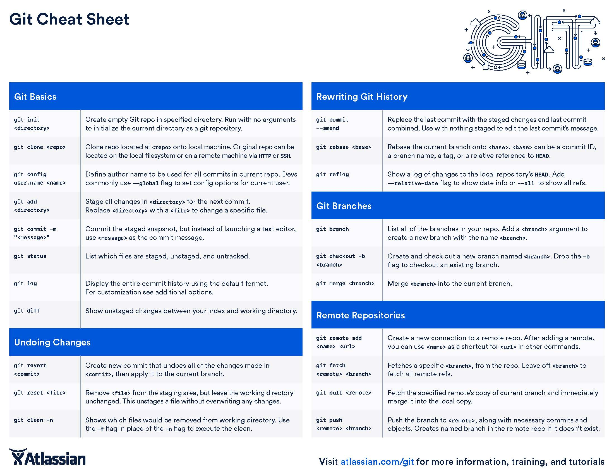
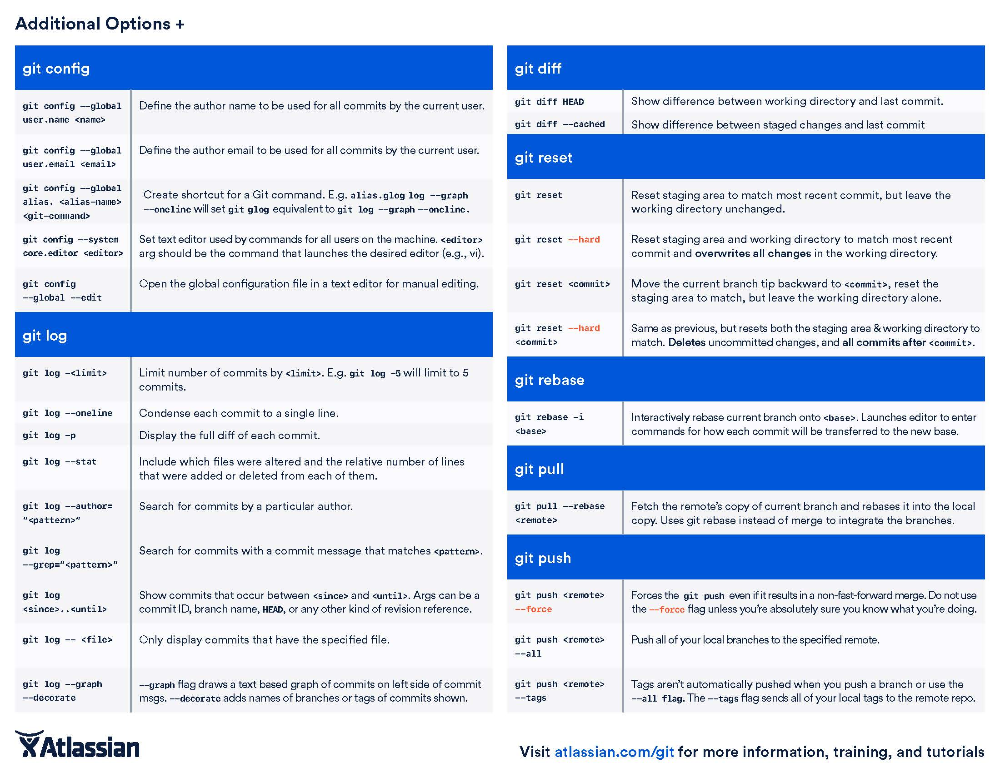

#### Basic Git Guide

---
Git is a crucial tool for programming and any kind of collaborative work that involves *source code* of any kind. It is one of several tools used for version control systems (VCS) available on the internet.

Though there are more git commands and combination of commands than I care to list, I would say that about 80% of all future git commands you will write will only be limited to less than 20% of all git commands available to you.

[atlassian.com](https://github.com/willidaniel91/salsolutions/blob/master/SOP/slack/Communication_With_Slack072017.md#acknowledgement-procedure) offers a phenomenal tutorial on git using BitBucket that I am requiring everyone to complete. Follow along the tutorial all the way through the end of **"Advanced Tips"** for a solid understanding of git and version control in general.

---
#### Git Standard Operating Procedure

##### Git config

1. `git config --global user.name "Your Full Name"` : set your git user name.

2. 'git config --global user.email "Your@email.com"' : set your git email.

3. `git config -l` : prints out your git configurations.

---
##### Saving Changes Locally:

1. Make sure you are in the correct project directory.
    ```
    $ cd directory/you/need/to/be/in
    ```
2. Create a new branch to isolate following changes; **NEVER WORK ON THE `master` BRANCH directly.**

    ```
    git branch [branch-name]
    ```

3. Switch over to newly created branch.
    ```
    git checkout [branch-name]
    ```

4. Work on the project in the newly created branch.

5. Add changes to staging area.
    ```
    git add .
    ```
    *`git add .` command adds all files in the project to be added to the staging area.*

    *or...*

    ```
    git add [path/to/file]
    ```
    *this command will add only the files listed onto the staging area.*

6. Commit changes.
    ```
    git commit -m "add message of what changes were made in the present tense"
    ```

    *Now your changes are saved but to your newly created branch.*

7. Merge changes into the master branch and delete branch if no longer in use.
    ```
    git checkout master
    ```
    ```
    git merge [branch-name]
    ```
    ```
    git branch -d [branch-name]
    ```
---
##### Adding and Working With a Remote Repository Basics:

1. Configure and set up: add a remote repo url to your local git config, and set an upstream branch for your local branches using the `git remote` command.

    ```
    git remote add <remote_name> <remote_repo_url>
    ```
    *This command will map remote repository at <remote_repo_url> to a ref in your local repo under <remote_name>. After adding a remote, you’ll be able to use <remote_name> as a shortcut for <url> in other Git commands.*
2. Once you have mapped the remote repo you can push local branches to it.

    ```
    git push -u <remote_name> <local_branch_name>
    ```
    *This command will push the local repo branch under <local_branch_name> to the remote repo at <remote_name>.*
3. Check the remote connections you have with other repositories:
    ```
    git remote -v
    ```
  * To remove a remote connection:
    ```
    git remote rm <name>
    ```
  * To rename a connection:
    ```
    git remote rename <old-name> <new-name>
    ```
  * **To view your remote branches, simply pass the -r flag to the git branch command.**
    ```
    git branch -r
    # the above command will print out something like this:
    # origin/master
    # origin/develop
    # origin/some-feature
    ```
    * Think of remote branches as a *read-only* branches
4. Once the connection between the remote git repository and the local repository has been established (detailed below: the `git remote add` and `git push -u`), simply use the `git push` command to push to `origin`.

    ```
    git push
    ```

##### Git Fetch

Fetching is what you do when you want to see what everybody else has been working on. Unlike [git pull](#git-pull) which automatically merges all the changes in the remote repository to the local repository, `git fetch` let's you review all the commits before merging.

1. Fetch remote repository:
    ```
    git fetch <remote>
    ```
    ```
    git fetch <remote> <branch>
    # same as above but fetch the specific remote branch.
    ```
2. To see what commits have been added to the upstream master, you can run a `git log` using origin/master as a filter
    ```
    git log --oneline master..origin/master
    ```
3. To approve the changes and merge them into your local master branch with the following commands:
    ```
    git checkout master
    git log origin/master
    ```
4. Now merge the remote branch with the local branch:
    ```
    git merge origin/master
    ```
    * now the origin/master and master both point to the same commit and the two are synchronized.

##### Git Pull

`git pull` rolls both `git fetch` and `git merge` into a single command.

```
git pull <remote>
```
is the same thing as calling...
```
git fetch <remote>
git merge origin/<current-branch>.
```

The other option is to use the `--rebase` option. The `--rebase` option can be used to ensure a linear history by preventing unnecessary merge commits.
```
git pull --rebase <remote>
```

**Configuration option for git pull --rebase**
```
git config --global branch.autosetuprebase always
```
After changing the configuration, `git pull` commands will integrate via `git rebase` instead of `git merge`.

##### Git Push

Pushing is how you transfer commits from your local repository to a remote repo. Pushing exports commits to remote branches. This has the potential to overwrite changes, so you need to be careful how you use it. There are several common usages.
```
git push <remote> <branch>
```
*Push the specified branch to <remote>, along with all of the necessary commits and internal objects.*

```
git push <remote> --force
```
*Force the push even if it results in a non-fast-forward merge. Do not use the --force flag unless you’re absolutely sure you know what you’re doing.*

```
git push <remote> --all
```
*Push all of your local branches to the specified remote.*

```
git push <remote> --tags
```
*The --tags flag sends all of your local tags to the remote repository.*

#### Git Clone

git clone is a Git command line utility which is used to target an existing repository and create a clone, or copy of the target repository to your local local machine.

```git
git clone <repo> <directory>
```

##### Example Remote Git Workflow

```
git checkout master
git fetch origin master
git rebase -i origin/master
# Squash commits, fix up commit messages etc.
git push origin master
```

#### Git Stash

git stash temporarily shelves (or stashes) changes you've made to your working copy so you can work on something else, and then come back and re-apply them later on. Stashing is handy if you need to quickly switch context and work on something else, but you're mid-way through a code change and aren't quite ready to commit.

```git
git stash
```

#### Pull Requests


---
#### Git Cheatsheet
Here is a git cheatsheet with all the most commonly used git commands for your referral:




---
### Advanced Git

git init
---
#### Bare Repositories --- git init --bare

* The --bare flag creates a repository without a working directory.

* Central repositories should always be created as bare repositories.

  * local repositories are non-bare.

* Most common usage case for `git init --bare` is to create a remote central repository.

```
ssh <user>@<host> cd path/above/repo git init --bare my-project.git
```
1. First, ssh into the server that will contain your central repository.
2. Then use the --bare flag to create a central storage repository that users can only git push or git pull from, but never commit to it directly.

---
#### Separate Git Directory --- git init --separate-git-dir=<GIT HIR>

* Creates a text file containing the path to <git dir> that acts as a link to the .git directory.
  * Useful if you want to keep your system config "dotfiles" (.bashrc, .vimrc, etc) in the home directory while keeping the .git folder elsewhere.
  * Or if your Git history has grown so large you need to move it elsewhere.

---

git clone
---
#### git clone -branch

* -branch argument lets you specify a branch to clone instead of the branch the remote HEAD is pointing to.

```
git clone -branch new_feature git://remoterepository.git
```

---
#### git clone -mirror vs. git clone -bare

* The --bare argument with git clone copies the remote repository without the working directory

* --mirror inherits the --bare behavior with the addition of all the extended refs of the remote repository.

---

Git Hooks
---
#### Overview

* Git hooks are scripts that run automatically every time a particular event occurs in a Git repository.

* Hooks can reside in either local or server-side repositories, and they are **only** executed in response to actions in that repository.

#### installation

* hooks reside in the `.git/hooks` directory.

* The *.sample* extension prevents hooks from executing by default.

  * Remove the *.sample* extension to "install" a hook.
  * Type scripts in the file using any executable scripting language **(just use shell and PERL scripts)**
  * The "shebang line" (#!/bin/sh) in each script defines how your file should be interpreted; change it to the path of your interpreter to use a different langauge.

To use Python, for example...
```Python
#!/usr/bin/env python
import sys, os
commit_msg_filepath = sys.argv[1]
with open(commit_msg_filepath, 'w') as f:
f.write("# Please include a useful commit message!")
```

* Hooks are local to any given Git repository and they are not copied over with `git clone`.

  * Anyone with access to the git repository can modify hooks

  * If you wish to include hooks with a clone, store your hooks in the actual project directory (above the .git directory) and create a [symlink](../docs/Symlinks072017.md) to it in  .git/hooks.

    * or simply refer to [this](https://git-scm.com/docs/git-init#_template_directory): all files contained in this template directory are copied int the .git directory every time you use `git init` or `git clone`

[source and tutorial](https://www.atlassian.com/git/tutorials/git-hooks)

---

Git Configuration Files
---

Git stores configuration options in three separate files, which lets you scope options to individual repositories (local), user (Global), or the entire system (system):

* Local: <repo>/.git/config – Repository-specific settings.

* Global: /.gitconfig – User-specific settings. This is where options set with the --global flag are stored.

* System: $(prefix)/etc/gitconfig – System-wide settings.

To change configuration options with different scopes you can use the `git config` command with these flags:
```
git config --local user.email <email>
git config --global alias.<alias-name> <git-command>
git config --system core.editor <editor>
```

Configuration Precedence: local > global > system

---

Git rebase
---

last edited and verified by Andrew Hunsaker on 6.7.2017
