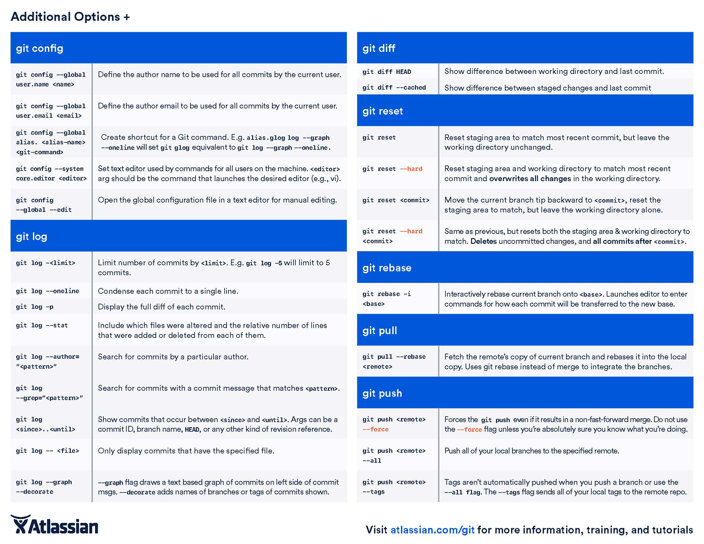

#### Basic Git Guide

---
Git is a crucial tool for programming and any kind of collaborative work that involves *source code* of any kind. It is one of several tools used for version control systems (VCS) available on the internet.

Though there are more git commands and combination of commands than I care to list, I would say that about 80% of all future git commands you will write will only be limited to less than 20% of all git commands available to you.

[atlassian.com](https://github.com/willidaniel91/salsolutions/blob/master/SOP/slack/Communication_With_Slack072017.md#acknowledgement-procedure) offers a phenomenal tutorial on git using BitBucket that I am requiring everyone to complete. Follow along the tutorial all the way through the end of **"Advanced Tips"** for a solid understanding of git and version control in general.

#### Git Standard Operating procedure

* Saving changes locally:

1. Make sure you are in the correct project directory.
```
$ cd directory/you/need/to/be/in
```
2. Create a new branch to isolate following changes; **NEVER WORK ON THE `master` BRANCH directly.**

```
git branch [branch-name]
```

3. Switch over to newly created branch.
```
git checkout [branch-name]
```

4. Work on project

5. Add changes to staging area
```
git add .
```
`git add .` command adds all files in the project to be added to the staging area.

or...
```
git add [path/to/file]
```
this command will add only the files listed onto the staging area.

6. Commit changes.
```
git commit -m "add message of what changes were made in the present tense"
```

Now your changes are saved but to your newly created branch.

7. Merge changes into the master branch and delete branch if no longer in use.
```
git checkout master
```
```
git merge [branch-name]
```
```
git branch -d [branch-name]
```

* Working with the remote repository:


---
#### Git Cheatsheet
Here is a git cheatsheet with all the most commonly used git commands for your referral:




---
### Advanced Git

git init
---
#### Bare Repositories --- git init --bare

* The --bare flag creates a repository without a working directory.

* Central repositories should always be created as bare repositories.

  * local repositories are non-bare.

* Most common usage case for `git init --bare` is to create a remote central repository.

```
ssh <user>@<host> cd path/above/repo git init --bare my-project.git
```
1. First, ssh into the server that will contain your central repository.
2. Then use the --bare flag to create a central storage repository that users can only git push or git pull from, but never commit to it directly.

---
#### Separate Git Directory --- git init --separate-git-dir=<GIT HIR>

* Creates a text file containing the path to <git dir> that acts as a link to the .git directory.
  * Useful if you want to keep your system config "dotfiles" (.bashrc, .vimrc, etc) in the home directory while keeping the .git folder elsewhere.
  * Or if your Git history has grown so large you need to move it elsewhere.

---

git clone
---
#### git clone -branch

* -branch argument lets you specify a branch to clone instead of the branch the remote HEAD is pointing to.

```
git clone -branch new_feature git://remoterepository.git
```

---
#### git clone -mirror vs. git clone -bare

* The --bare argument with git clone copies the remote repository without the working directory

* --mirror inherits the --bare behavior with the addition of all the extended refs of the remote repository.

---

Git Hooks
---
#### Overview

* Git hooks are scripts that run automatically every time a particular event occurs in a Git repository.

* Hooks can reside in either local or server-side repositories, and they are **only** executed in response to actions in that repository.

#### installation

* hooks reside in the `.git/hooks` directory.

* The *.sample* extension prevents hooks from executing by default.

  * Remove the *.sample* extension to "install" a hook.
  * Type scripts in the file using any executable scripting language **(just use shell and PERL scripts)**
  * The "shebang line" (#!/bin/sh) in each script defines how your file should be interpreted; change it to the path of your interpreter to use a different langauge.

To use Python, for example...
```Python
#!/usr/bin/env python
import sys, os
commit_msg_filepath = sys.argv[1]
with open(commit_msg_filepath, 'w') as f:
f.write("# Please include a useful commit message!")
```

* Hooks are local to any given Git repository and they are not copied over with `git clone`.

  * Anyone with access to the git repository can modify hooks

  * If you wish to include hooks with a clone, store your hooks in the actual project directory (above the .git directory) and create a [symlink](../docs/Symlinks072017.md) to it in  .git/hooks.

    * or simply refer to [this](https://git-scm.com/docs/git-init#_template_directory): all files contained in this template directory are copied int the .git directory every time you use `git init` or `git clone`

[source and tutorial](https://www.atlassian.com/git/tutorials/git-hooks)


---
last edited and verified by Andrew Hunsaker on 6.7.2017
