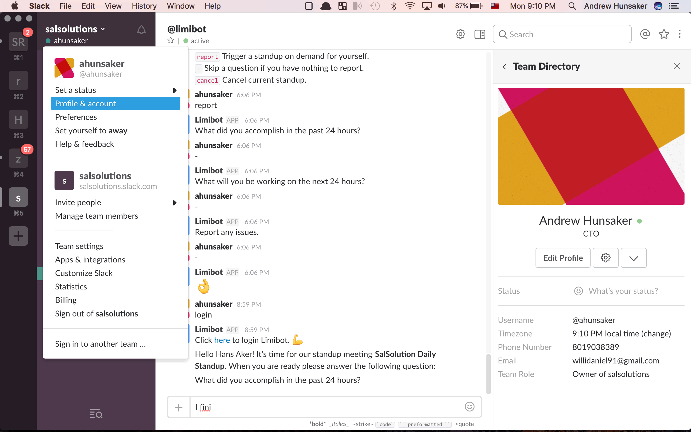
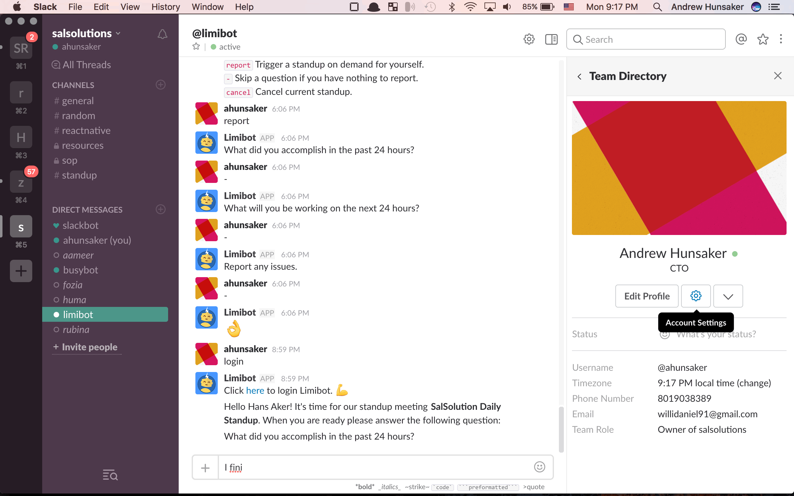
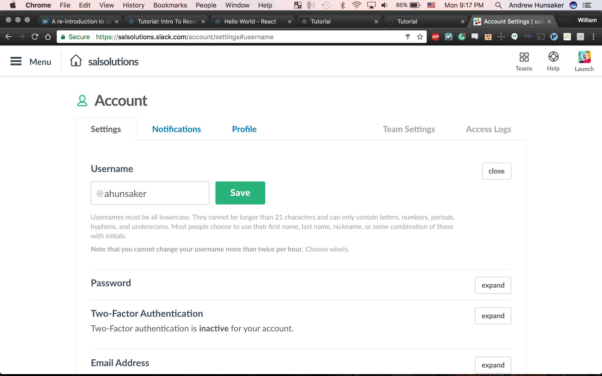
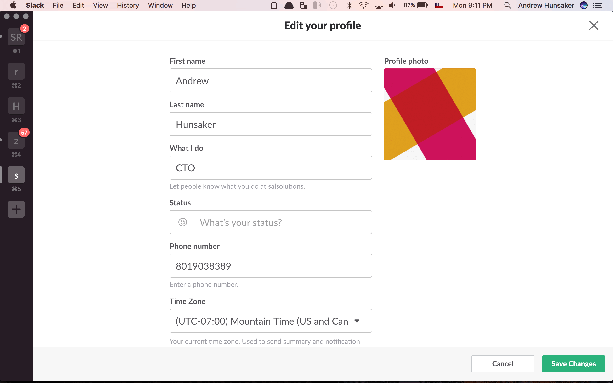
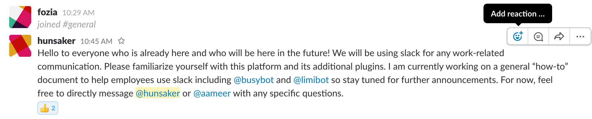
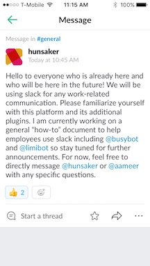

#### Communication With Slack

---
All work related communications between employees should be done in slack. Using _slack_ and its many extensions, you can assign tasks to yourself or other employees and its daily standup functionality will allow all employees to better track progress as well as productivity.

##### Sal Solutions slack Group

* The slack group address is [salsolutions.slack.com](http://salsolutions.slack.com)

##### ID Naming convention

* For the sake of simplicity and better organization the user names for Sal Solutions will follow the following format:

> **[first letter of your first name][your last name]**

* Example: my full name is Andrew Hunsaker so my slack id is **@ahunsaker**
###### Changing your username
1. Click on the drop bar next to your name on the left. nav bar 
2. Click on the **Account Settings** wheel. 
3. Click **Expand** next to the username section, change your user name and click **Save**. 
###### Editing your profile
1. Click on the drop bar next to your name on the left. nav bar 
2. Enter your full name, your phone number (local number only for now) as well as your time zone. 


---
#### busybot usage
busybot is used as a collaborative to-do list where everyone can assign tasks to him/herself or any other member of the team. You can set a due date, set subtasks and much more. Our use of busybot will, for the moment, be limited to simple assignments and tracking of tasks.

* How to assign a task:

1. send a direct message to busybot *or* in any chat box type: ```/busybot [@person to assign to] [task to do] [due date]```

>  /busybot @ahunsaker Do something important by tomorrow at 2pm


* **Please do confirm with an acknowledgement upon receiving a task**
  * refer to the [acknowledgement procedure](#acknowledgement-procedure)

* How to see a list of all tasks:
1. send a direct message to busybot: ```list [@person] **or** [#channel]``` or...
2. in any chat box type: ```/busybot list [@person] **or** [#channel]```

---
#### limibot usage
Everyday at 9pm local time (subject to change), every employee is expected to participate in a standup meeting via limibot. The process is pretty straight forward: all you are expected to do is answer a series of questions.  


> this is an example output from completing the daily standup

* every employee's status update will be available on the *__#standup__* channel on slack.

* please include as much detail as possible and do not worry too much about any faults in grammar or spelling.

* DO NOT **EVER** POST DIRECTLY TO THE STANDUP CHANNEL; limibot will ask you the questions every night and automatically populate the #standup channel
---
#### Acknowledgement procedure

Though the ability to make channel-wide announcements and assign tasks to each other is important, it is entirely useless without an acknowledgement from the task assignee that he/she is aware of the assignment. An acknowledgement, in this case can be anything that can act as proof that you have read the announcement or task that was assigned to you. **We will use slack's built-in emoji's for acknowledgement.**

The process for acknowledgement is simple:
1. Read and _make sure_ you __clearly__ understand the content.
2. Hover over (desktop) or select and message (mobile) and select the "Add reaction..." button:

* Desktop: 

* Mobile:

  * Add reaction button is to the bottom left corner on mobile.

* If you have any questions feel free to directly message @hunsaker or @aameer on slack and we will try out best to get back to you as soon as possible.

---
last edited and verified by Andrew Hunsaker on 3.7.2017
