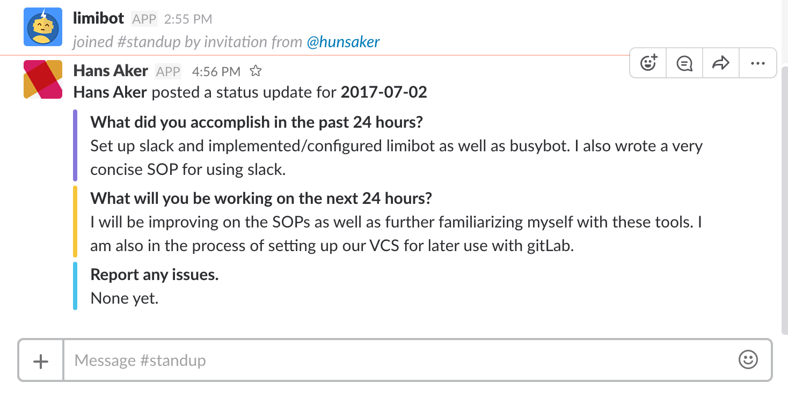

#### Communication With Slack

---
All work related communications between employees should be done in slack. Using _slack_ and its many extensions, you can assign tasks to yourself or other employees and its daily standup functionality will allow all employees to better track progress as well as productivity.

##### Sal Solutions slack Group

* the slack group address is [salsolutions.slack.com](http://salsolutions.slack.com)

---
#### busybot usage
busybot is used as a collaborative to-do list where everyone can assign either themselves or other people tasks to. You can set a due date, set subtasks and much more. Our use of busybot will, for the moment, be limited to simple assignments and tracking of tasks:

> an example of assigning a task

* **Please do confirm with an acknowledgement upon receiving a task**
  * refer to the [acknowledgement procedure](#acknowledgement-procedure)

---
#### limibot usage
Everyday at 9pm local time (subject to change), every employee is expected to participate in the standup meeting via limibot. The process is pretty straight forward and all you need to do is honestly answer a series of questions.  

> this is an example output from completing the daily standup

* the details of every employee will be available on the *__#standup__* channel on slack.

* please include as much detail as possible and do not worry about any mistakes in grammar or spelling.

* DO NOT POST DIRECTLY TO THE STANDUP CHANNEL; limibot will ask you the questions and automatically populate #standup
---
#### Acknowledgement procedure

Though the ability to make channel-wide announcements and assign tasks to each other is important, it is entirely without an acknowledgement procedure. An acknowledgement is just proof that you have read the announcement or task that was assigned to you. We will use slack's built-in emoji's for acknowledgement.

The process for acknowledgement is simple:
1. Read and _make sure_ you __clearly__ understand the content.
2. Hover over (desktop) or select and message (mobile) and select the "Add reaction..." button:

* Desktop: 

* Mobile:

  * Add reaction button is to the bottom left corner on mobile.

* If you have any questions feel free to directly message @hunsaker or @aameer on slack and we will try out best to get back to you as soon as possible.

---
last edited and verified by Andrew Hunsaker on 3.7.2017
